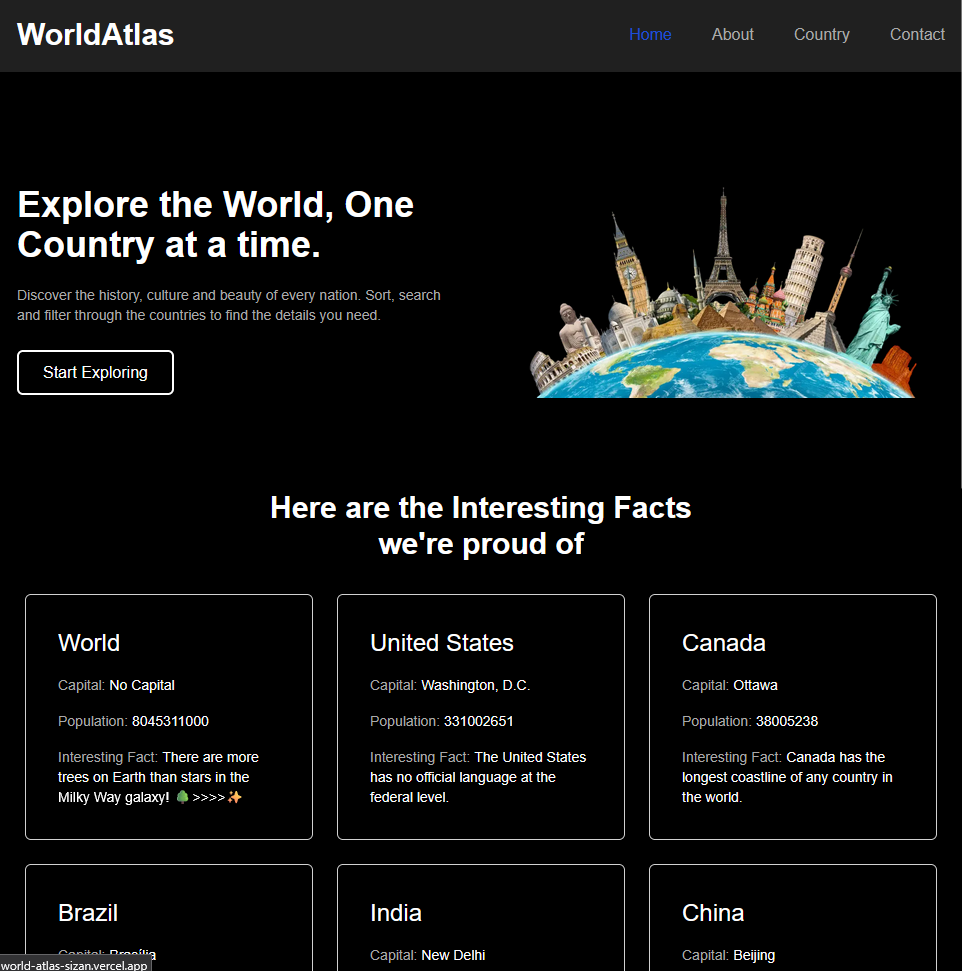
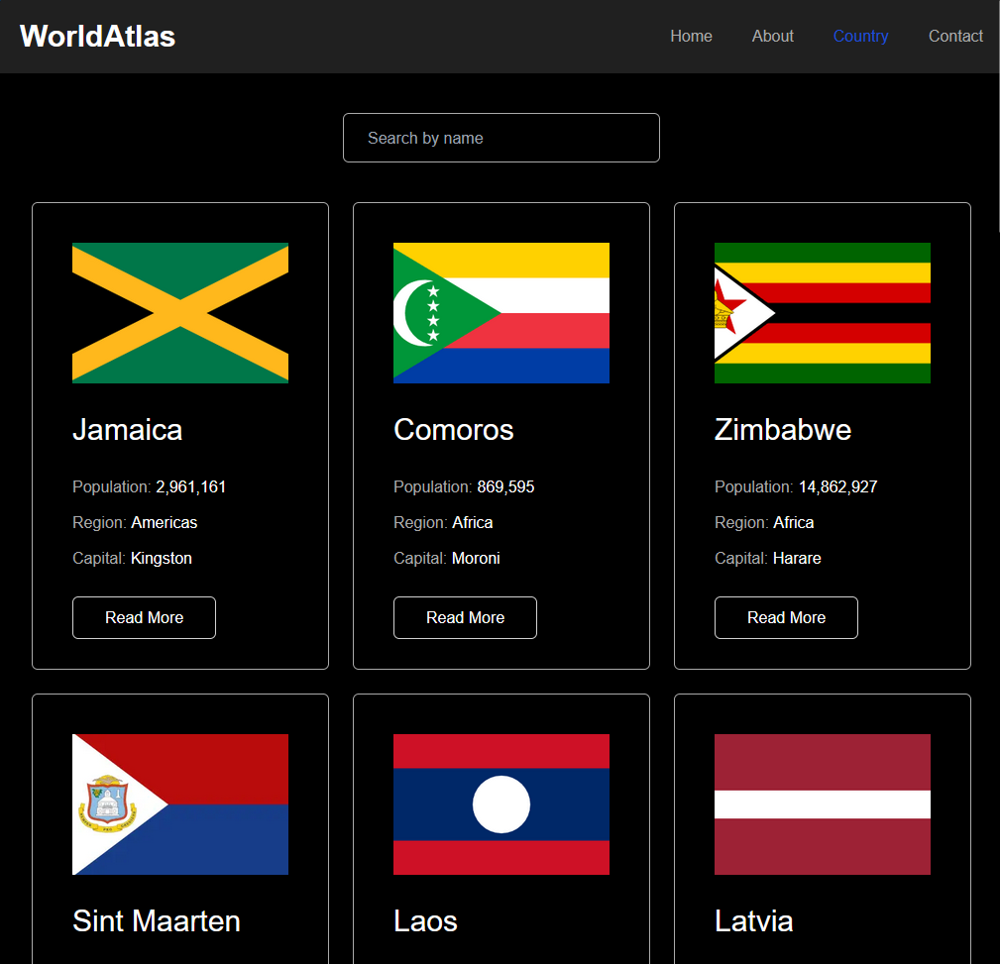
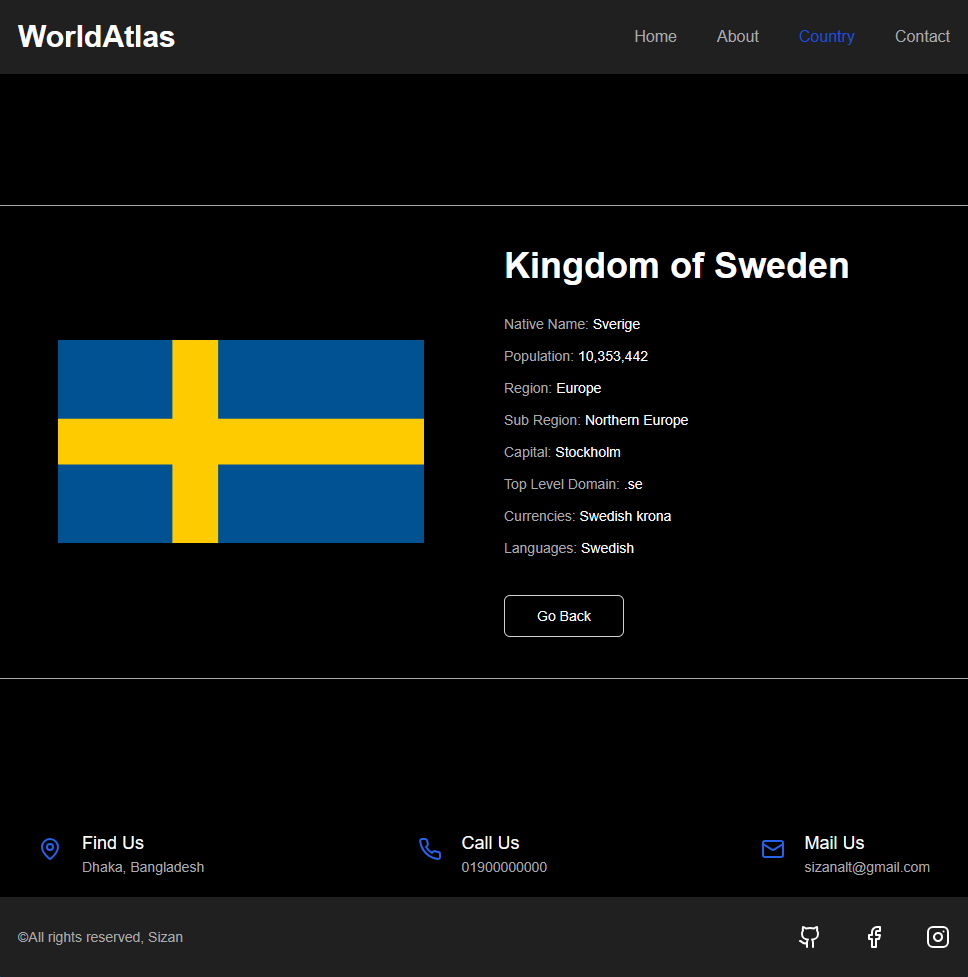
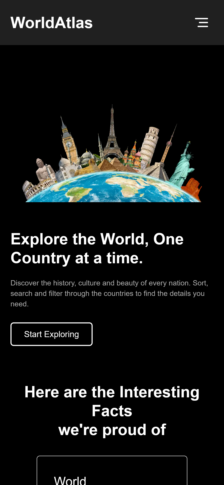
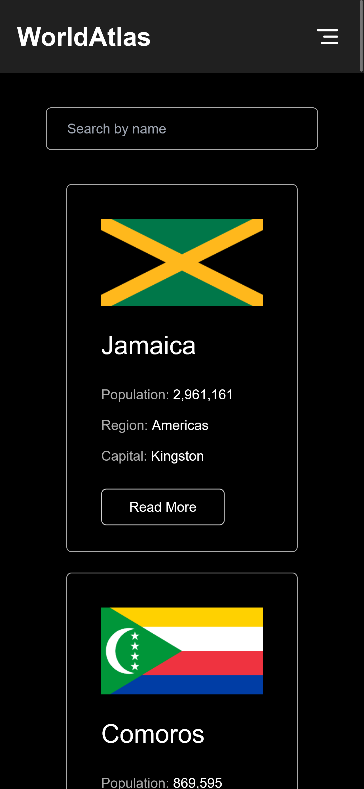
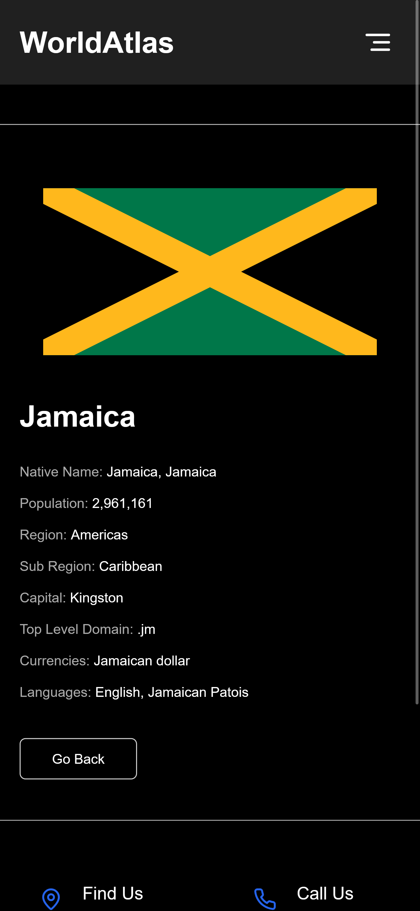

# 🌍 World Atlas

A **static website** built with **Next.js** and **TypeScript** that provides detailed information about countries around the world. Explore country data, flags, capitals, population, and other interesting facts in a clean and responsive interface.

---

## Preview

### Desktop

<p align="center">
  
  
  
</p>

### Mobile

<p align="center">
  
  
  
</p>

---

## 🖥️ Features

- **Static site generation** with Next.js and TypeScript for fast performance  
- **Responsive design** for mobile and desktop  
- **Country information** including flags, capital, population, region, and more  
- **Search and filter functionality** to quickly find countries  
- **Clean and modern UI** for easy navigation and readability  

---

## 🛠️ Tech Stack

- **Next.js** – React framework for static site generation and routing  
- **TypeScript** – Type safety and improved developer experience  
- **React** – Component-based UI design  
- **Tailwind** – Styling and responsive layouts  

---

## 🚀 Getting Started

#### Clone the repo:

```bash
git clone https://github.com/sizan14789/WorldAtlas.git
```

#### install dependencies
```
npm i
```
#### Run
```
npm run dev
```

Open http://localhost:3000 with your browser to see the result.